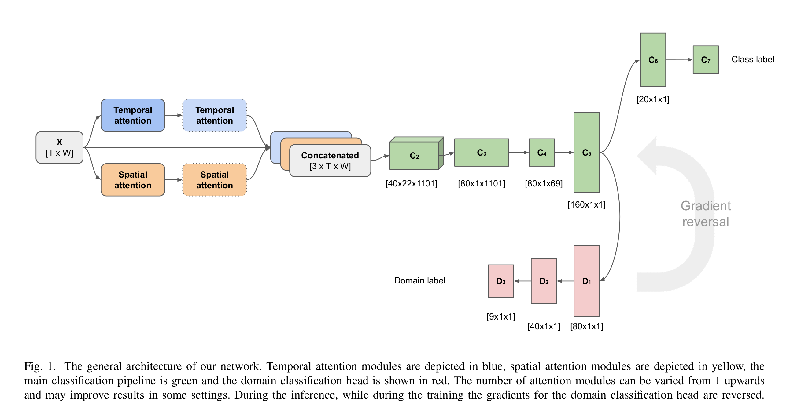

# Domain adaptation for EEG motor imagery classification

This is code for the project on deep domain adaptation for EEG motor imagery classification. We implement a pipeline which combines and extends *[Parallel Spatial–Temporal Self-Attention CNN-Based Motor Imagery Classification for BCI](https://www.frontiersin.org/articles/10.3389/fnins.2020.587520/full) by Liu et al. and *[Domain-Adversarial Training of Neural Networks](https://arxiv.org/abs/1505.07818) by Ganin et al.


### Environment and requirements
- Pytorch 1.7
- Python 3.9
- MNE tools

### Network Structure



### Dataset

We use BCI competition *[IV Graz dataset 2a](https://www.bbci.de/competition/iv/) 
Before running  the code, ensure that you created a directory
```
dataset/2a
```
where you have put all of the competition ```.gdf``` files. Also you need ```.mat``` files with the annotations.

### Training and evaluation

Run `python main.py`, which represents the main training script. It has a number of parametes you may want to tinker with.
```
--dataroot 
default='dataset/2a/'
```
Location of th Graz dataset

```
--batch
default=20 
```
Batch size for training. Evaluation batch size will be twice as big.


```
--lr 
default = 1e-5
```
Learning rate for the Adam optimizer

```
--epochs
default=200
```
Number of epochs to train for

```
--annotated
default=0.0
```
The default ratio of annotated examples from the target domain to learn from. Increase it to increase the ammount of annotated target domain data to train.

```
--features'
default='attention')
```
Pick a feature generator for DANN. "concat" just processes the signal, "attention" is equivalent to PSTSA, double_attention add additional attention layer to PSTSA'

```
--dropout' 
```
Usage of dropout. Improves performance in some cases, original papers didn't use it.

```
--target_weight
default = 1.0
```
Increases lr for target domain on classification to make training on it more substantial.

### Code structure
```main.py``` contains the main trainin and evaluation scripts. Evaluation will be performed automatically after training.

```model.py``` contains all of the model modules that we use in this project

``data_loader.py`` contains our dataloader for the gratz dataset.

### Official implementations and code references

https://github.com/Shenyonglong/Spatial-Temporal-attention-
https://github.com/fungtion/DANN_py3